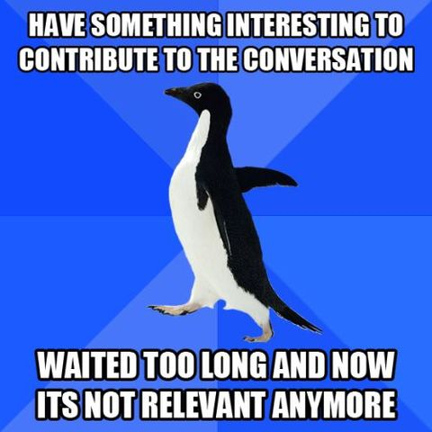

!SLIDE title-slide

# Ruby On Rails 
## Pierwsza Krew ;-)
### Tomek "Tomash" Stachewicz
#### Szkolenie Ruby On Rails, 2012-04-12
## 

!SLIDE

## Rozkład jazdy w dużym skrócie

1. <u>Wstęp</u>
2. Podstawy Ruby
3. Ruby On Rails - ActiveRecord
4. RoR - kontrolery, widoki
5. Autentykacja, filtry, gemy, biblioteki
6. Helpery, Javascript

!SLIDE bullets incremental

# Rozeznanie w terenie

## Zanim zaczniemy kilka pytań

* Doświadczenie w webaplikacjach?
* Znajomość wzorców projektowych i MVC?
* Wcześniejszy kontakt z Rubym i RoR?

!SLIDE bullets incremental

# Last but not least

* Działające środowisko Rails na laptopie?

!SLIDE

# Pytaj!

### A **question** may be either a linguistic expression used to make a *request for information*, or else the request itself made by such an expression. This information may be provided with an **answer**.

!SLIDE center

